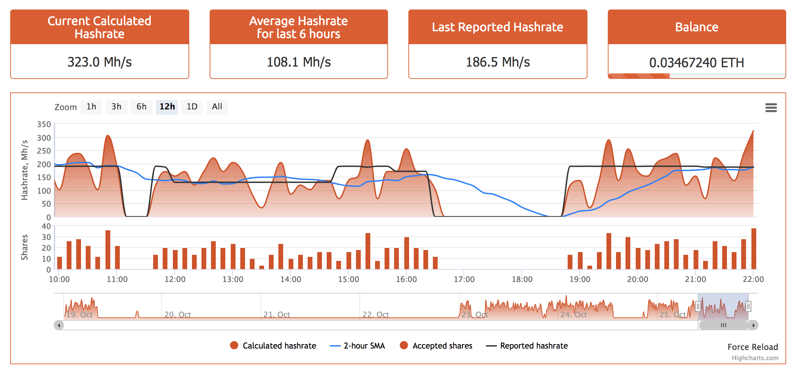

# check-hash-rate
Monitor reported hash rate from nanopool, this application will check your reported hash rate from [nanopool API](https://eth.nanopool.org/api#api-Miner-LastReportedHashrateUser) every 10mins and if the reported hash rate is equal to zero(0) it will automatically restart the PC

# Nanopool Monitoring

# Screenshot (Check Hash Rate)

## For More Info
contact me @[https://github.com/nenjotsu](https://github.com/nenjotsu)

## Issues
Please feel free to submit an issue
